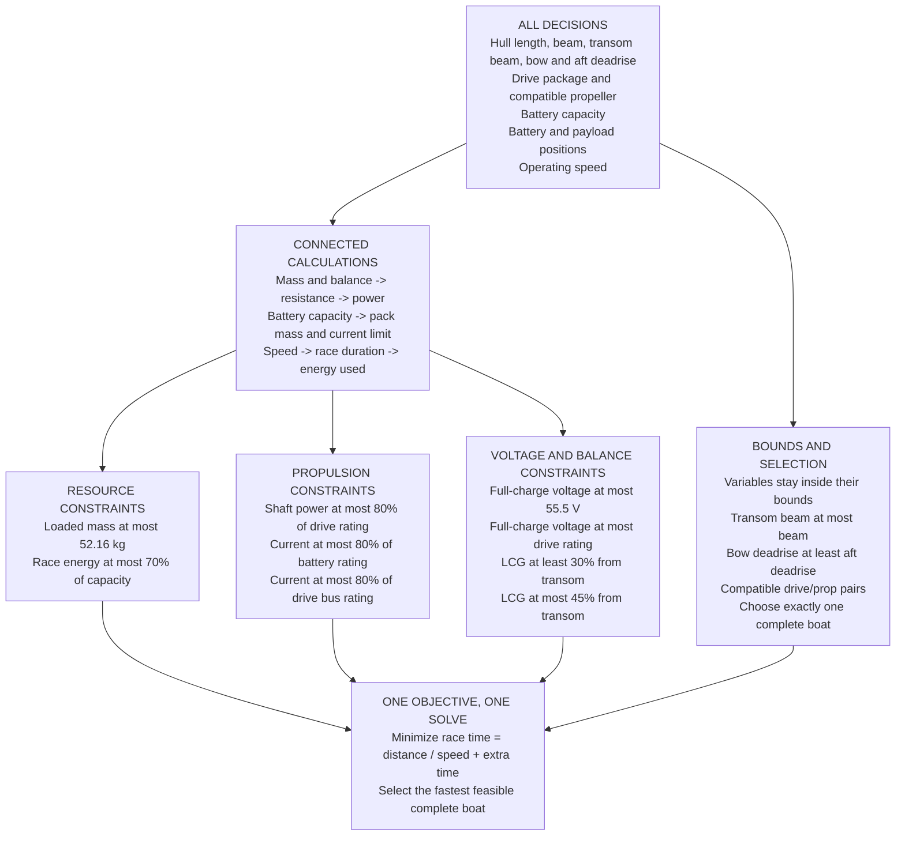

# Boat optimization

One optimization problem chooses the complete boat: hull geometry, drive,
propeller, battery capacity, component placement and operating speed together.
Hull geometry, battery capacity, placements and speed are **continuous** variables
within bounds; only the drive/propeller pair is a discrete choice.

The objective is the lowest estimated time over 2 miles. Mass, placement,
resistance, power and battery energy stay connected in the same model.
"Best" always means best found within the variable bounds and the assumed model.

## Objectives, decisions and constraints

This map describes the **current executable model**. Values below are the
illustrative defaults in `scenario.json`, not validated design limits.



**Objective:** minimize `T(h, c, v) = 3218.688 / v + 20` seconds jointly over all choices.
Here `h` is hull geometry, `c` is the component/placement setup, and `v` is speed in m/s. Power and
energy constraints determine which speeds are feasible. The extra 20 seconds is
an assumed course allowance, not a maneuvering simulation.

| Decision variable | Type | Current bounds or choices |
| --- | --- | --- |
| Hull length | continuous | 0.9144-3.048 m (3-10 ft) |
| Hull beam | continuous | 0.3048-1.2192 m (1-4 ft) |
| Transom beam | continuous | 0.2286-1.2192 m (0.75-4 ft), never wider than the beam |
| Bow deadrise | continuous | 30-50 degrees |
| Aft deadrise | continuous | 6-16 degrees |
| Battery capacity | continuous | 400-1500 Wh (pack mass follows at the assumed 180 Wh/kg) |
| Operating speed | continuous | 4-14 m/s |
| Payload position | continuous | 25-50% of hull length forward from transom |
| Battery position | continuous | 25-45% of hull length forward from transom |
| Drive package | discrete | Assumed 4 kW or 6 kW continuous shaft-power package |
| Propeller | discrete | Assumed A or B; B is allowed only with the 6 kW drive |

| Whole-boat constraint | Enforced relationship |
| --- | --- |
| Loaded mass | Total mass <= 52.16312255 kg (115 lb) |
| Energy | Race energy <= 0.70 * nominal pack capacity in Wh |
| Shaft power | Required shaft power <= 0.80 * continuous drive shaft rating |
| Battery current | Total DC current <= 0.80 * capacity in Ah * continuous C-rate |
| Drive current | Total DC current <= 0.80 * drive continuous bus-current rating |
| System voltage | Full-charge battery voltage <= 55.5 V |
| Drive voltage | Full-charge battery voltage <= drive maximum voltage |
| LCG lower bound | Longitudinal center of gravity >= 0.30 * hull length from transom |
| LCG upper bound | Longitudinal center of gravity <= 0.45 * hull length from transom |
| Transom width | Transom beam <= beam |
| Deadrise order | Bow deadrise >= aft deadrise |

The model also requires every variable to stay inside its bounds, a compatible
drive/prop pair and exactly one selected complete boat. Component masses, efficiencies and ratings
come from the chosen catalog entries; they are not independent decision variables.
Battery voltage/chemistry and the laminate assumptions are fixed in this version.
The 30 lb payload is included in every candidate as a fixed input, not a choice.
Capacity, resistance, power, energy, total mass and LCG are derived.

The continuous variables are handled by a nonlinear optimizer (SciPy SLSQP), not
by finalops. finalops does the final selection among the boats the optimizer
returns; its solver variables are binary candidate selections, one per optimizer
result, as described below.

The seven-minute benchmark is a comparison, not a hard constraint. Weight
and energy are constraints, not additional objectives. Cost is not modeled. Freeboard, stability,
self-righting, packaging, structural strength and other items under "Unmodeled
requirements" below are still pending; a feasible result does not certify them.

## Run

From the repository root, using Python 3.10 or newer and Git:

```sh
python3 -m venv optimization/.venv
optimization/.venv/bin/python -m pip install -r optimization/requirements.txt
optimization/.venv/bin/python -m optimization.solve --out optimization/runs/continuous
optimization/.venv/bin/python -m unittest optimization.test_optimization -v
```

For private repository access, authenticate Git to GitHub first. The dependency
is pinned to the inspected finalops revision rather than an unrelated PyPI package.
Use a new output directory for each experiment; existing runs are never replaced.
An infeasible search writes its diagnostics and exits with code 2. Invalid data or
an unproven solver result exits with code 1.

**This first version is an executable demonstration, not a boat design recommendation.**
Its component catalog, prices, efficiencies and hull resistance are invented
fixtures. A fast result shows that the optimization pipeline works, not that a
boat will achieve that speed. Every result is labeled accordingly and has
`build_ready: false`.

## Continuous search

For each valid drive/propeller pair (three with the default catalog),
`continuous.py` runs SLSQP from 2^`starts_log2` scrambled Sobol starting points
(32 by default, seeded from `scenario.json` so runs are repeatable). The nine
continuous variables are scaled to the unit cube, and the ten whole-boat margins
plus the transom-width and deadrise-order margins enter as inequality constraints scaled to unit
size. Each constraint keeps a small scaled buffer so a converged point still
passes the independent nonnegative-margin recheck.

Every solver endpoint is evaluated through `model.py` and recorded, whether it
converged, is feasible or not. Endpoints are then passed to a single finalops
model. For each endpoint `i`, let `x_i` be its binary selection variable:

```text
minimize sum(T_i * x_i)
subject to sum(x_i) = 1
           sum(margin_ki * x_i) >= 0 for each modeled constraint k
           x_i in {0, 1}
```

Because exactly one candidate is selected, its own margins must all pass.
Only endpoints with all margins at least zero enter that model. If none do,
all endpoints are passed instead so finalops reports the infeasibility.
Equal-time candidates are ties; there is no secondary objective. In the results,
each endpoint is stored as its own "hull" so the viewer can show every design the
optimizer reached.

**This is a multistart local search.** It finds good designs reliably on a smooth
model but does not prove a global optimum. More starts (`starts_log2`) or different
seeds are the check. The test suite also requires the result to beat the best
feasible point on a 3-per-variable grid of the bounds.

**Expect solutions on the bounds.** With the current synthetic model nothing
penalizes a long, narrow hull: resistance falls with length and narrower beam or
transom, and those also cut shell mass. The transom drag exponent (0.2) is
invented, like the other resistance coefficients, and only makes a wider transom
cost drag. Length, beam and transom beam therefore land on their limits. There is no hydrostatic
constraint (displacement, freeboard) and no ride or slamming term to stop this.
Read the result as showing where the model is missing physics.

## Connected relationships

```text
shell area estimate = surface multiplier * length * mean(beam, transom beam) / cos(mean of bow and aft deadrise)
hull mass = shell area estimate * laminate mass per area + structure allowance

total mass = hull + payload + fixed equipment + drive + prop + battery
LCG = sum(component mass * longitudinal position) / total mass

resistance = f(length, beam, transom beam, aft deadrise, total mass, speed, LCG)
shaft power = resistance * speed / propeller efficiency
battery power = shaft power / drive efficiency + electronics power

race time = distance / speed + extra time allowance
energy used (Wh) = battery power (W) * race time (s) / 3600
battery mass (kg) = capacity (Wh) / specific energy (Wh/kg)
capacity (Ah) = capacity (Wh) / nominal voltage (V)
current (A) = battery power (W) / assumed loaded voltage (V)
```

Battery capacity is a choice, while pack mass, boat mass and power are derived.
Checking energy sufficiency closes the battery-weight-power relationship without
manually iterating those quantities. The optimizer may choose extra battery; the
model does not enforce an artificial equality that leaves no energy reserve.

The present resistance function is a normalized power law with explicit mass,
speed and geometry factors, plus a quadratic LCG penalty. **It is neither
Savitsky nor CFD nor an experimentally fitted marine model.** Its numbers and
exponents only exercise coupling. The shell area and fixed component positions
are also assumptions, not CAD outputs.

## finalops integration

Inspected repository: https://github.com/MarMar888/finalops

Pinned revision: `02ebe70a9e19ea584cb525485ddc5e8ac0467620`.
Package directory: `finalops/` within that repository.

At this revision the package wraps PuLP/CBC and supports linear and mixed-integer
linear formulations. Its other listed branch also has the same package layout;
there is no direct nonlinear solver API in the inspected package.

We therefore evaluate nonlinear expressions before constructing the single selection
model; the continuous search itself runs in SciPy before that. Every candidate is a binary choice with a precomputed time and constraint
margins. Exactly one is selected, with every selected margin required to be
nonnegative. Those are linear constraints over nonlinear-evaluated candidates.
There is no claim that PuLP solves nonlinear expressions directly.

finalops provides the requirement ledger, model construction, CBC solve,
feasibility checks, rule checks, optimality report and infeasibility diagnosis.
The integration additionally requires a proven optimal solver status, rechecks
the selected candidate and recalculates the final winner through the evaluator.

## Inputs and limits

Edit `scenario.json`; `--scenario path/to/file.json` selects another experiment.
SI units are explicit in field names; energy uses Wh, and positions
use fractions of hull length. Inputs reject unknown fields, nonfinite values,
reversed or nonpositive ranges, invalid efficiencies and inconsistent voltage ordering.

| Input or constraint | Starting value | Basis |
| --- | --- | --- |
| Distance | 3218.688 m | PEP27 rules: uncrewed craft race 2 miles (`../docs/PEP-Rules/`) |
| Benchmark | 420 s | User-reported target to beat; not a hard feasibility rule |
| Payload | 13.6077711 kg | PEP27 rule 17: 30 lb removable payload, fixed in every candidate |
| Mass limit | 52.16 kg | Earlier 115 lb design bound; not a verified hull capacity, and not a PEP27 rule — PEP27 caps capacity (500 Ah) and voltage, not total mass |
| Voltage limit | 55.5 V | PEP27 rule 10: total voltage at most 55.5 V, checked at full charge |
| Energy allowance | 70% of capacity | Assumed reserve policy |
| Continuous rating allowance | 80% | Assumed design margin |
| LCG interval | 30-45% from transom | Provisional search constraint |
| Component values, hull coefficients | See scenario | Synthetic demonstration values |

Modeled hard rejects: total mass, usable energy, shaft power, battery
current, drive bus current, system/drive full-charge voltage and the LCG interval.
Drive current is conservatively compared with total battery current, including
electronics. It represents **DC bus current**, not motor phase current.
The continuous-current battery model uses Ah times C-rate and a fixed assumed
loaded voltage; it does not predict sag or temperature.

All extra course time is charged at cruise electrical demand. This is a simple
accounting convention, not a claim to model acceleration, peaks or turns.

Unmodeled requirements stay visible in `results.json`: freeboard, flooded
buoyancy, self-righting, structural strength, packaging, real propulsion matching,
transients, thermal limits, navigation and physical safety requirements. A passed
finalops report certifies only the encoded selection problem, not competition
compliance or the omitted physics. The aggregate fixed-equipment allowance does
not verify that all previously discussed sensors fit the mass limit.

## Results

```text
runs/<experiment>/
  scenario.json                  exact inputs for this run
  results.json                   winner, hull ranking, margins, rejection counts
  candidates.json                all complete boats, including rejected ones
  ledger.json                    one set of choices, data and requirement links
  finalops-report.json           one solver result and feasibility diagnosis
  selection.json                 the selected complete boat, or infeasible
  hulls/hull_*/candidates.json    one optimizer endpoint per folder, for the viewer
```

New reports identify the formulation with `optimization_mode: continuous_nlp`.
When no candidate is feasible, the single model reports infeasibility and the
result contains no winner. A rejection count
is not an irreducible conflict: one candidate can fail several constraints.
finalops reports supply the solver's conflict diagnosis separately.

## Improve one relationship at a time

First replace synthetic parts with verified mass and continuous-rating
data. Then replace `resistance_n()` with a validated estimator or interpolated
CFD/test data over a stated range of speeds, loading and geometry. Reject
out-of-range evaluations rather than extrapolating silently. Replace the shell
mass estimate with construction/CAD data and add hydrostatic feasibility checks.

Add the missing constraints (hydrostatics and freeboard, then a ride term) so the
geometry variables stop landing on their bounds, and compare results across
uncertain inputs and seeds.
Fossen's full motion model is not required for this first step.

The older `optimization-plan.md` remains background research. This folder
implements the continuous joint formulation agreed in the later discussion.

## Results viewer

The main Next.js site exposes `/optimization`, linked from the shared navigation.
It reads completed runs from `optimization/runs/` on each request, independently
of the BOM database. Choose a run, compare hulls, then inspect feasible and rejected
setups and their constraint margins. Refresh picks up newly completed runs.

The Plots tab compares twelve major relationships across all evaluated setups:
time/capacity, power/speed, resistance/speed, energy/speed, time/mass,
energy/capacity, current/battery capacity, reserve/battery capacity, resistance/LCG,
time/length, resistance/beam and resistance/deadrise. A custom comparison supports
any pair of fifteen factors. Hull and feasibility filters apply to every plot;
selecting a point highlights that setup across the plots. These plots show joint
design combinations, not controlled single-variable sensitivity experiments.
Missing hull data is explicitly reported rather than silently omitted.

Import accepts a `results.json` summary in the browser without uploading or
persisting it. Imported summaries include per-hull fastest candidates, but not the
complete search; those setup files are only available for runs present on the server.
Historical runs that chose battery mass (`battery_mass_kg`) still display, using their
recorded capacity. Existing reports without `optimization_mode` are recognized as historical nested
runs and read from their original `inner/hull_*/candidates.json` paths. Saved runs
are not migrated or overwritten.
Since `runs/` is gitignored, deployed instances need provisioned run files or a
browser import. An empty deployment shows an empty state, not invented results.
The viewer does not execute the optimizer or change any BOM choices.

```sh
cd dashboard   # the Next.js app and its package.json live here
pnpm dev
pnpm exec playwright install chromium
pnpm exec playwright test
```

Browser tests create and clean up their own small run fixture. Their screenshots
and test artifacts live under `.context/` at the repo root.
To use an existing Chrome installation instead of downloading Chromium, run
`PLAYWRIGHT_CHANNEL=chrome pnpm exec playwright test`.

## Explore notebook

`explore.ipynb` is a working model of the boat described in `optimization2.md` for exploring by hand: a prismatic
hull with OpenPlaning for the planing balance, plus hydrostatics, propeller, battery voltage and the constraints, with
sweeps, sliders and a small search. It is separate from the finalops solver above and uses placeholder component data.

```sh
optimization/.venv/bin/python -m pip install -r optimization/requirements-notebook.txt
optimization/.venv/bin/jupyter lab optimization/explore.ipynb
```

`openplaning-reference.ipynb` is a different, smaller notebook: a reference for the `PlaningBoat` class
itself (what it takes as input vs what it computes, split into hull and propulsion), built on the
openplaning README's own documented Savitsky '76 worked example rather than this project's hull - use it
to understand the library before trusting `explore.ipynb`'s use of it. Same setup as above, just point
`jupyter lab` at `optimization/openplaning-reference.ipynb` instead.
